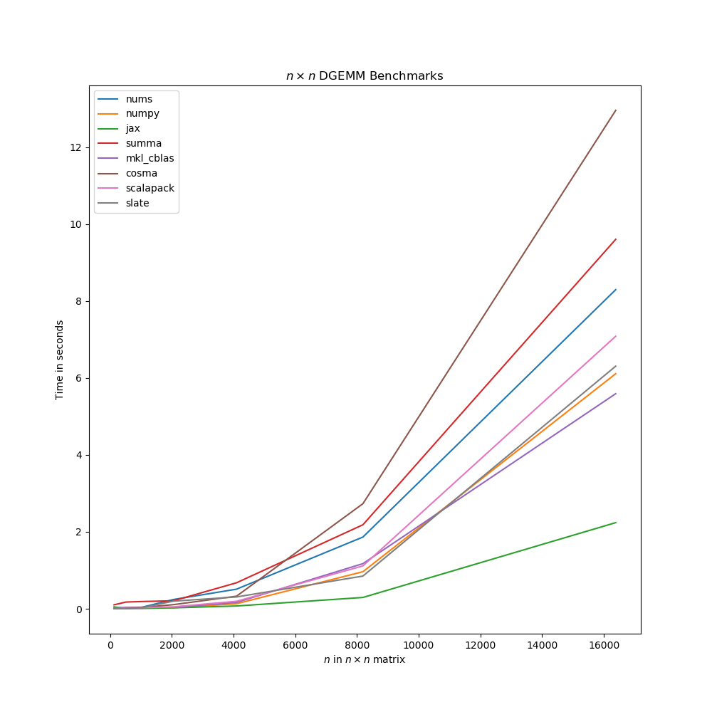

# DGEMM Benchmarks for NumS
A small case study to compare popular DGEMM libraries with NumS. Here, we explore different kinds of optimizations with MPI, MKL, etc. Benchmarkings were all done on an Intel Xeon processor with 32 cores. More details about the CPU are below.

## Installation Guide

### Getting Started
1. Install essential tools for compiling and debugging:

```sh
sudo snap install cmake --classic
sudo apt-get install gfortran
```
2. Install [Anaconda](https://docs.anaconda.com/anaconda/install/index.html) to isolate python packages when benchmarking.

### ScaLAPACK (Netlib) Installation
Skip this installation if on Intel architecture. Intel has their own distribution of ScaLAPACK opimized with MKL and IntelMPI. ScaLAPACK should install all the [other packages](http://www.netlib.org/scalapack/scalapack.jpg) it depends on such as LAPACK, PBLAS, BLAS, BLACS (Same goes for the Intel MKL installation).

1. Install openmpi
```sh
sudo apt-get install penmpi-bin libopenmpi-dev
sudo apt-get install libblas-dev liblapack-dev libatlas-base-dev 
```
2. Build and compile
```sh
rm CMakeCache.txt
mkdir build
cd build
cmake ..
make
```

### ScaLAPACK (MKL) Installation
1. Install MKL. A guide for how to install it in Ubuntu Linux is [here](https://github.com/eddelbuettel/mkl4deb). With Ubuntu 20.04, simply install it with:
```sh
sudo apt install intel-mkl
```
2. Additionally, you have to install IntelMPI for communication algorithms in ScaLAPACK MKL to work properly. Installation guide can be found [here](https://software.intel.com/content/www/us/en/develop/tools/oneapi/hpc-toolkit/download.html?operatingsystem=linux&distributions=aptpackagemanager).
3. Set environent variables in the shell. It will also properly set the IntelMPI environment. (This will be needed later if you want to compile C/C++ programs with MKL library):
```sh
export MKL_LIB_DIR=/opt/intel/compilers_and_libraries/linux/mkl/lib/intel64
export MKL_INCLUDE_DIR=/opt/intel/compilers_and_libraries/linux/mkl/include
export LD_LIBRARY_PATH=$MKL_LIB_DIR:$LD_LIBRARY_PATH
export MKLROOT=/opt/intel/mkl
export CPATH=$CPATH:/opt/intel/oneapi/mkl/2021.3.0/include
source /opt/intel/bin/compilervars.sh intel64
source /opt/intel/oneapi/setvars.sh
```
4. Setting an envrionment variable for number of threads can also be helpful if it happens to not be running on multiple threads. Make sure to set the number of threads to physical cores (on hyperthreaded system). It can also be customized to run with `mpirun` nodes. For best practices on a high performance single node machine, set MPI nodes to the number of sockets and MKL/OpenMP threads to cores per socket:
```sh
export MKL_NUM_THREADS=32
# Run ScaLAPACK with MPI and OpenMP/MKL configuration
export MKL_NUM_THREADS=16; mpirun -np 2 ./program
```

5. Do not install any other MPI versions or BLAS libraries as they can fail to link correctly to Intel specific programs. To load everything automatically at a new shell login, it is also helpful to add the envionrment variables and setup shell scripts to `~/.bashrc`.

```sh
echo 'export MKL_LIB_DIR=/opt/intel/compilers_and_libraries/linux/mkl/lib/intel64' >> ~/.bashrc
echo 'export MKL_INCLUDE_DIR=/opt/intel/compilers_and_libraries/linux/mkl/include' >> ~/.bashrc 
echo 'export LD_LIBRARY_PATH=$MKL_LIB_DIR:$LD_LIBRARY_PATH' >> ~/.bashrc 
echo 'export MKLROOT=/opt/intel/mkl' >> ~/.bashrc 
echo 'export CPATH=$CPATH:/opt/intel/oneapi/mkl/2021.3.0/include' >> ~/.bashrc 
echo 'source /opt/intel/bin/compilervars.sh intel64' >> ~/.bashrc 
echo 'source /opt/intel/oneapi/setvars.sh' >> ~/.bashrc 
```

### NumPy with MKL LAPACK Installation
1. Create a new environment, and then install and link MKL for Python.
```sh
conda create --name numpy python=3.7 -y
conda install -f mkl
conda install -f numpy
conda install mkl-service
```
2. Confirm that it has been installed:
```python
python3
Python 3.6.9 (default, Jan 26 2021, 15:33:00) 
[GCC 8.4.0] on linux
Type "help", "copyright", "credits" or "license" for more information.
>>> import numpy as np
>>> np.show_config()
blas_mkl_info:
    libraries = ['mkl_rt', 'pthread']
    library_dirs = ['/home/brian/anaconda3/envs/nums/lib']
    define_macros = [('SCIPY_MKL_H', None), ('HAVE_CBLAS', None)]
    include_dirs = ['/home/brian/anaconda3/envs/nums/include']
blas_opt_info:
    libraries = ['mkl_rt', 'pthread']
    library_dirs = ['/home/brian/anaconda3/envs/nums/lib']
    define_macros = [('SCIPY_MKL_H', None), ('HAVE_CBLAS', None)]
    include_dirs = ['/home/brian/anaconda3/envs/nums/include']
lapack_mkl_info:
    libraries = ['mkl_rt', 'pthread']
    library_dirs = ['/home/brian/anaconda3/envs/nums/lib']
    define_macros = [('SCIPY_MKL_H', None), ('HAVE_CBLAS', None)]
    include_dirs = ['/home/brian/anaconda3/envs/nums/include']
lapack_opt_info:
    libraries = ['mkl_rt', 'pthread']
    library_dirs = ['/home/brian/anaconda3/envs/nums/lib']
    define_macros = [('SCIPY_MKL_H', None), ('HAVE_CBLAS', None)]
    include_dirs = ['/home/brian/anaconda3/envs/nums/include']
```
By default, it may be set to OpenBLAS, so always check before running benchmarks.

### NumS Installation
1. Installation is as follows from the NumS [setup guide](https://github.com/nums-project/nums):
```sh
pip install nums
# Run below to have NumPy use MKL.
conda install -fy mkl
conda install -fy numpy scipy
```
2. Also create a development environment
```sh
cd nums
conda create --name nums python=3.7 -y
conda activate nums
pip install -e ".[testing]"
```

### Jax Installation
1. Create a new environment and install necessary packages.
```sh
conda create --name jax python=3.7 -y
conda activate jax
pip3 install jax jaxlib numpy
```

### COSMA Installation
1. Installation instructions [here](https://github.com/eth-cscs/COSMA). 
2. Note that all MKL envrionment variables should be set correctly. Again, it is probably safe to enter these commands again:
```sh
export MKL_LIB_DIR=/opt/intel/compilers_and_libraries/linux/mkl/lib/intel64
export MKL_INCLUDE_DIR=/opt/intel/compilers_and_libraries/linux/mkl/include
export LD_LIBRARY_PATH=$MKL_LIB_DIR:$LD_LIBRARY_PATH
export MKLROOT=/opt/intel/mkl
export CPATH=$CPATH:/opt/intel/oneapi/mkl/2021.3.0/include
source /opt/intel/bin/compilervars.sh intel64
source /opt/intel/oneapi/setvars.sh
```
3. Install with these commands. Cloning with the recursive flag is **VERY** important!
```sh
git clone --recursive https://github.com/eth-cscs/COSMA cosma && cd cosma
mkdir build && cd build
cmake -DCOSMA_BLAS=MKL -DCOSMA_SCALAPACK=MKL -DCMAKE_INSTALL_PREFIX=../install/cosma ..
make -j
make install
```

### SLATE Installation
1. Installation instructions: [here](https://bitbucket.org/icl/slate/src/master/).
2. Install with these commands:
```sh
git clone --recursive https://bitbucket.org/icl/slate
git pull
git submodule update
```

3. Before running, make sure that environment variables are set right by running these commands:
```sh
export MKL_LIB_DIR=/opt/intel/compilers_and_libraries/linux/mkl/lib/intel64
export MKL_INCLUDE_DIR=/opt/intel/compilers_and_libraries/linux/mkl/include
export LD_LIBRARY_PATH=$MKL_LIB_DIR:$LD_LIBRARY_PATH
export MKLROOT=/opt/intel/mkl
export CPATH=$CPATH:/opt/intel/oneapi/mkl/2021.3.0/include
source /opt/intel/bin/compilervars.sh intel64
source /opt/intel/oneapi/setvars.sh
```

4. Create a `make.inc` file to properly link the libaries installed, with IntelMPI and MKL, the file should look like this:
```
CXX  = mpicxx
FC   = mpif90
blas = mkl
mkl_blacs = intelmpi
gpu_backend = none
```

5. Compile
```sh
make -j && sudo make install -j
```

## Running Benchmarks

### NumPy with MKL
Just make sure optimizations are on and import MKL before NumPy just to be safe:
```python
import mkl
import numpy as np
```
If MKL isn't installed, then Python would throw an `ImportError`.

### MKL's LAPACK `cblas_dgemm()`
1. A special Makefile to include and link Intel MKL's header files was made. A guide for how to make it was shown [here for reference](https://www.youtube.com/watch?v=PxMCthwZ8pw&t=945s) and [here](https://software.intel.com/content/www/us/en/develop/documentation/mkl-tutorial-c/top/multiplying-matrices-using-dgemm.html). Additionally, there is a link advisor that calculates what flags you need depending on what you have instaled: [link advisor](https://software.intel.com/content/www/us/en/develop/tools/oneapi/components/onemkl/link-line-advisor.html). Make sure environment variables are written to `~/.bashrc` (if using bash):
```sh
export MKL_LIB_DIR=/opt/intel/compilers_and_libraries/linux/mkl/lib/intel64
export MKL_INCLUDE_DIR=/opt/intel/compilers_and_libraries/linux/mkl/include
export LD_LIBRARY_PATH=$MKL_LIB_DIR:$LD_LIBRARY_PATH
export MKLROOT=/opt/intel/mkl
```
2. Compile and run
```sh
make cblas
export MKL_NUM_THREADS=32 #if not already set
./cblas <dimension size>
```
*Currently, the implentation is only doing square matrices for the convenience of benchmarking.*

3. Additionally, `mkl_malloc()` is an optimized version of `malloc()` that can support SIMD vectorization with Intel Intrinsics. The additional parameter inside of `mkl_malloc()` is the number of bytes. Since the CPU used can support 512 bit wide vector instrutions, 64 bytes is used to squeeze in a bit more data parallelism.
[Reference](https://software.intel.com/content/www/us/en/develop/documentation/onemkl-developer-reference-c/top/support-functions/memory-management/mkl-malloc.html)

4. (Additional Information) [Notes for MKL installation](https://cirrus.readthedocs.io/en/master/software-libraries/intel_mkl.html). Clarification whether to use ILP or LP interface:
ILP vs LP interface layer
Most applications will use 32-bit (4-byte) integers. This means the MKL 32-bit integer inteface should be selected (which gives the _lp64 extensions seen in the examples above).
For applications which require, e.g., very large array indices (greater than 2^31-1 elements), the 64-bit integer interface is required. This gives rise to _ilp64 appended to library names. This may also require -DMKL_ILP64 at the compilation stage. Check the Intel link line advisor for specific cases.

## COSMA and ScaLAPACK
1. Make sure COSMA is compiled. COSMA has a miniapp that benchmarks both COSMA and ScaLAPACK. Check the flags for usage.
```sh
mpirun -np 4 ./build/miniapp/pxgemm_miniapp -m 10000 -n 10000 -k 10000 --block_a=100,100 --block_b=100,100 --block_c=100,100 --p_grid=2,2 --transpose=NN --type=double --algorithm=cosma
```

## SUMMA implementation in C++ and OpenMPI
```sh
make summa
mpirun -np 4 ./summa <dimensions of i> <dimensions of j> <dimensions of k>
```

MPI Matrix multiplication implementation
http://www.umsl.edu/~siegelj/CS4740_5740/AlgorithmsII/mpi_mm.html


SUMMA?
https://github.com/irifed/mpi101
https://github.com/JGU-HPC/parallelprogrammingbook/tree/master/chapter9/matrix_matrix_mult

Links:
https://github.com/Schlaubischlump/cannons-algorithm.git 
https://github.com/andadiana/cannon-algorithm-mpi.git


## Benchmarks


### Shared Memory Only Algorithms Benchmark

These packages are only supported on shared memory systems

Libraries experimented with are numpy, mkl_cblas, and jax. MKL BLAS should have near identical performance to NumPy, as both are calling the same function `cblas_dgemm()`. Performance on NumPy doesn't seem to be affected by the fact that it is running in Python. Jax seems to be the fastest, due to it's low level optimization and JIT compilation using XLA.

### Distributed Memory Only Algorithms Benchmark (on single node)

These algorithms can be run on both shared and distributed memory systems.

### Distributed Memory Only Algorithms Benchmark (on cluster)
coming soon


#### Architecture
The benchmarking was done on an Azure instance using this Intel architecture listed below with `lscpu`.
```
Architecture:        x86_64
CPU op-mode(s):      32-bit, 64-bit
Byte Order:          Little Endian
CPU(s):              64
On-line CPU(s) list: 0-63
Thread(s) per core:  2
Core(s) per socket:  16
Socket(s):           2
NUMA node(s):        2
Vendor ID:           GenuineIntel
CPU family:          6
Model:               85
Model name:          Intel(R) Xeon(R) Platinum 8272CL CPU @ 2.60GHz
Stepping:            7
CPU MHz:             2593.904
BogoMIPS:            5187.80
Virtualization:      VT-x
Hypervisor vendor:   Microsoft
Virtualization type: full
L1d cache:           32K
L1i cache:           32K
L2 cache:            1024K
L3 cache:            36608K
NUMA node0 CPU(s):   0-31
NUMA node1 CPU(s):   32-63
Flags:               fpu vme de pse tsc msr pae mce cx8 apic sep mtrr pge mca cmov pat pse36 clflush mmx fxsr sse sse2 ss ht syscall nx pdpe1gb rdtscp lm constant_tsc rep_good nopl xtopology cpuid pni pclmulqdq vmx ssse3 fma cx16 pcid sse4_1 sse4_2 movbe popcnt aes xsave avx f16c rdrand hypervisor lahf_lm abm 3dnowprefetch invpcid_single tpr_shadow vnmi ept vpid ept_ad fsgsbase bmi1 hle avx2 smep bmi2 erms invpcid rtm mpx avx512f avx512dq rdseed adx smap clflushopt clwb avx512cd avx512bw avx512vl xsaveopt xsavec xgetbv1 xsaves avx512_vnni md_clear arch_capabilities
```


limit benchmarks to n = 8GB

Discussion about parallel LA packages
https://stackoverflow.com/questions/10025866/parallel-linear-algebra-for-multicore-system

